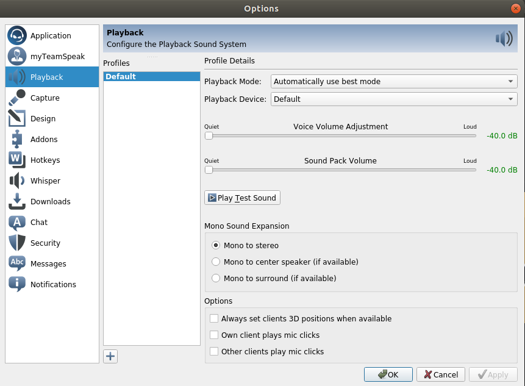
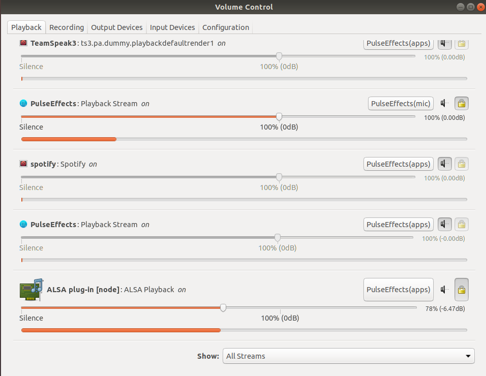
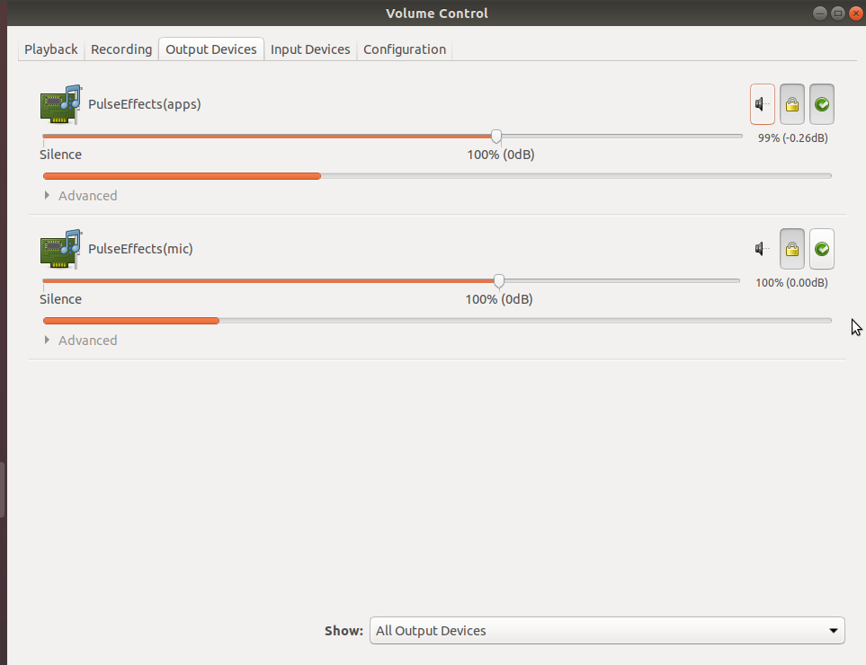
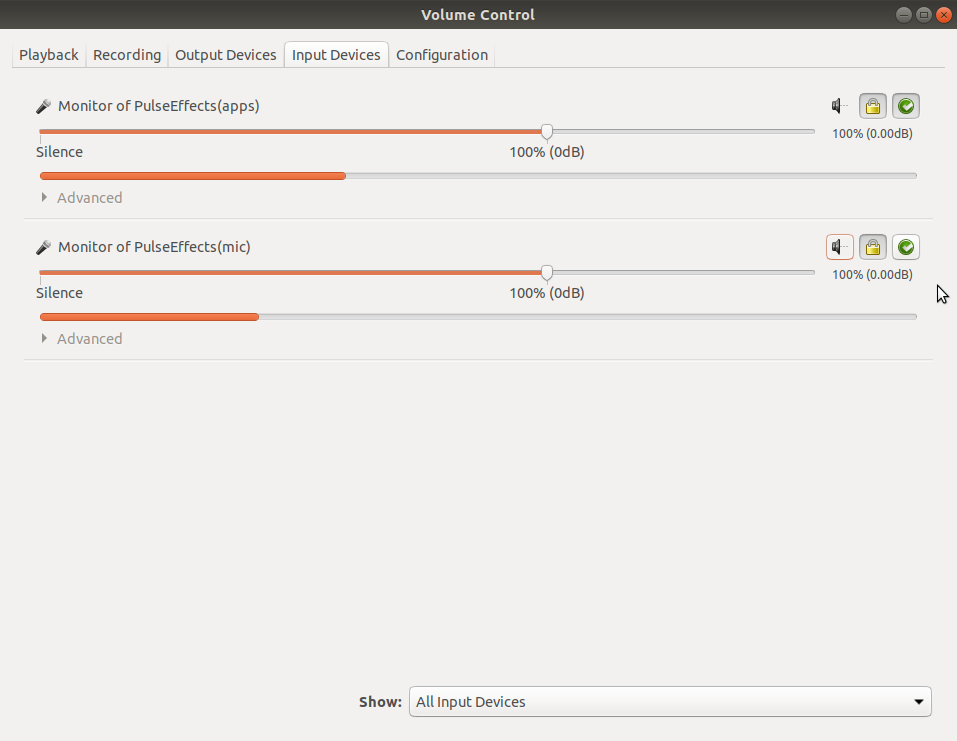

# TeamSpeak 3 Music Bot
TeamSpeak 3 Music Bot in NodeJS with some cool features

Watch the demo: <a href="https://streamable.com/crtqz"/>https://streamable.com/crtqz</a>

Features:
- Music (Youtube API)
  - adding songs to the queue
  - skipping current song, removing last added song
  - getting title of the current song
  - counting songs in the queue
  
- League of Legends (RIOT API)
  - logging 5 best champions of the player in terms of mastery points
  - logging player's current match with all the players, their champions, divisions and ranked winratio
  - logging average cs per minute in last player's games and comparing that score to another player

- Other
  - sending a welcome message with some statistics to every user that joins our server
  
## Installation
Tested on Linux, Ubuntu 16.04.5 and 18.04.3

You will need <a href="https://nodejs.org/en/">NodeJS</a>, <a href="https://ffmpeg.org/">ffmpeg</a>, <a href="https://teamspeak.com/en/downloads/">TeamSpeak3 Client</a>, libasound2-dev and desktop environment (to launch the TS3 Client).

### Step 1
- Clone this repo to your local machine
```
git clone https://github.com/xDroni/TS3-Music-Bot.git
```
### Step 2
- Install packages
```
npm install
```
### Step 3
- Copy your API keys to the appropriate files in the secrets folder
### Step 4
- Launch your TeamSpeak3 Client and connect to the server

### Step 5 
- On the same machine run the music bot with parameters (clientname is the name of client that you set in step 4)
```
npm start host="server_address" login="query_login" password="query_password" botname="MusicBotName" clientname="ClientName"
```

### TeamSpeak3 client capture settings 




My sound settings using PulseEffects with equalizer (that's optional)

ALSA plug-in [node] will appear when you add the song to the queue








## How does it work
Bot connects to the server as ServerQuery, it joins to the channel where is the client specified in the clientname parameter. Bot listens to the channel chat for the commands.
If we add a song to the queue, the bot starts to stream the music.

## Usage
If you have everything set up you can start using commands.

### Music
##### Add song to the queue
`!sr <title or link of the song>`

##### Skip the current song
`!skip`

##### Remove the last added song from the queue
`!skiplast`

##### Get the title of the current song
`!current`

##### Get the queue size
`!size`


### League of Legends
##### Get 5 best champions
`!mastery <summoner name>`

##### Get live game
`!live <summoner name>`

##### Get average cs / min
`!cs <summoner name>`

### Properties
##### Get the current properties
`!properties`

##### Change the property
`!propertiesSet <name> <value>`
`Example: !propertiesSet region euw`
`This changes the region to euw`
